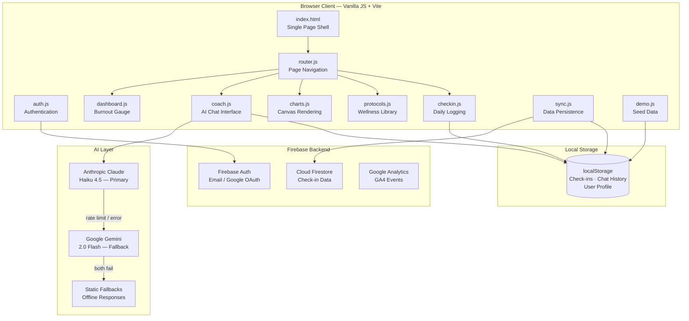
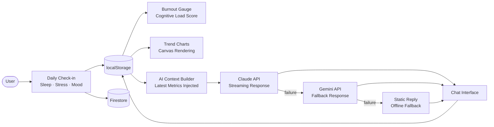
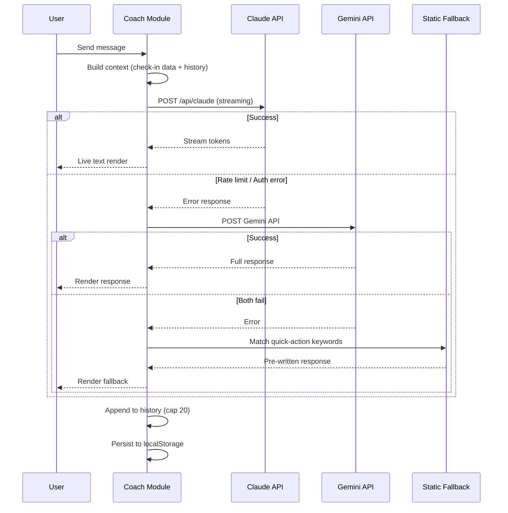
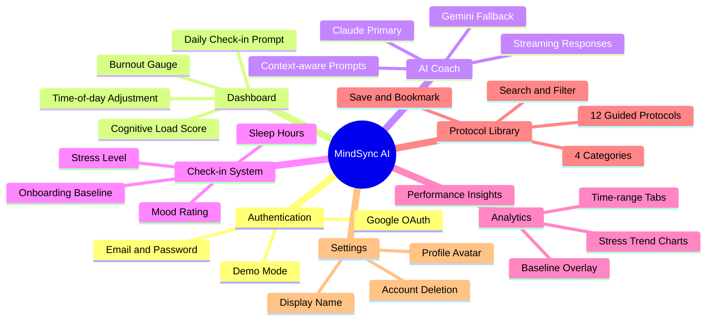

# MindSync AI

**Predict Burnout. Preserve Brilliance.**

MindSync AI is an adaptive mental wellness coaching platform built for high-performance individuals. It monitors cognitive load, delivers personalized AI coaching, and surfaces behavioral patterns — all before burnout takes hold.

---

## Architecture Overview



---

## Data Flow



---

## AI Fallback Chain



---

## Feature Map



---

## Tech Stack

| Layer | Technology | Version |
|---|---|---|
| Build Tool | Vite | 5.x |
| Runtime | Vanilla JavaScript (ES Modules) | ES2022 |
| Styling | Vanilla CSS + Custom Properties | — |
| AI — Primary | Anthropic Claude (`claude-haiku-4-5`) | SDK 0.82 |
| AI — Fallback | Google Gemini (`gemini-2.0-flash`) | SDK 0.24 |
| Auth and Database | Firebase Authentication + Firestore | 10.x |
| Charts | Custom HTML5 Canvas (no library) | — |
| Fonts | Google Fonts — Inter, JetBrains Mono | — |
| Node.js | 18 or later | — |

---

## Project Structure

```
MindSync-AI/
├── index.html                  # Single HTML shell — all page markup lives here
├── vite.config.js              # Dev server with /api/claude proxy (avoids CORS)
├── package.json
├── .env                        # API keys — never commit this file
│
└── src/
    ├── main.js                 # Entry point — imports all modules, binds globals
    ├── router.js               # Page transitions with crossfade animation
    ├── auth.js                 # Sign-up, sign-in, Google OAuth, logout, toasts
    ├── firebase.js             # Firebase app initialization
    ├── dashboard.js            # Burnout gauge animation and metric display
    ├── checkin.js              # Daily check-in modal and onboarding flow
    ├── coach.js                # AI coach — Claude, Gemini, streaming, history
    ├── charts.js               # Canvas chart rendering for trends and insights
    ├── protocols.js            # 12 wellness protocols — filter, save, start
    ├── settings.js             # Profile management and account deletion
    ├── sync.js                 # Firestore sync for check-in persistence
    ├── demo.js                 # Demo account with 35-day seeded data
    ├── userState.js            # New vs. returning user detection helpers
    │
    └── styles/
        ├── base.css            # CSS variables, typography, resets
        ├── components.css      # Buttons, forms, cards, modals, toasts
        ├── layout.css          # Sidebar, shell structure, responsive grid
        └── pages.css           # Per-page styles (landing, dashboard, coach, etc.)
```

---

## Setup

### Prerequisites

- Node.js 18+
- An [Anthropic API key](https://console.anthropic.com)
- A [Google AI API key](https://aistudio.google.com/app/apikey)
- A Firebase project with **Authentication** (Email/Password + Google) and **Firestore** enabled

### Installation

```bash
git clone <repo-url>
cd MindSync-AI
npm install
```

### Environment Variables

Create a `.env` file in the project root:

```env
VITE_ANTHROPIC_API_KEY=sk-ant-...
VITE_GEMINI_API_KEY=AIzaSy...
VITE_FIREBASE_API_KEY=AIzaSy...
VITE_FIREBASE_AUTH_DOMAIN=your-project.firebaseapp.com
VITE_FIREBASE_PROJECT_ID=your-project-id
VITE_FIREBASE_STORAGE_BUCKET=your-project.appspot.com
VITE_FIREBASE_MESSAGING_SENDER_ID=000000000000
VITE_FIREBASE_APP_ID=1:000000000000:web:abc123
VITE_FIREBASE_MEASUREMENT_ID=G-XXXXXXXXXX
```

### Development

```bash
npm run dev        # Start dev server at http://localhost:3000
npm run build      # Production build → dist/
npm run preview    # Preview production build at http://localhost:4173
```

---

## Demo Account

A fully pre-seeded demo account is available to explore all features without setting up Firebase:

| Field | Value |
|---|---|
| Email | `demo@mindsync.ai` |
| Password | `pass@123` |
| Data | 35 days of synthetic check-ins + sample AI chat history |

---

## API Integration Details

### Claude — Primary AI

| Setting | Value |
|---|---|
| Model | `claude-haiku-4-5` |
| Max tokens | 1000 |
| Mode | Streaming via `client.messages.stream()` |
| Routing | Proxied through `/api/claude` (Vite dev) to avoid CORS |

The coach builds a system prompt that injects the user's latest check-in metrics (sleep, stress, mood, burnout score) before every request, making responses context-aware without storing sensitive data server-side.

### Gemini — Fallback AI

| Setting | Value |
|---|---|
| Model | `gemini-2.0-flash` |
| Max tokens | 800 |
| Safety | Blocks harassment, hate speech, and explicit content |
| Activation | Automatic on any Claude error or timeout |

### Firestore Schema

```
users/
└── {uid}/
    └── checkins/
        └── {YYYY-MM-DD}/
            ├── sleep     : number
            ├── stress    : number
            ├── mood      : "good" | "neutral" | "bad"
            └── timestamp : ISO string
```

---

## Security Notes

- The Claude API key is exposed in the browser via Vite's `VITE_` prefix during development. For production, route AI requests through a secure backend (Vercel Edge Functions, AWS Lambda, or Cloudflare Workers).
- Firestore security rules should restrict reads and writes to authenticated users only.
- The `.env` file is listed in `.gitignore` — never override this.

---

## License

MIT
